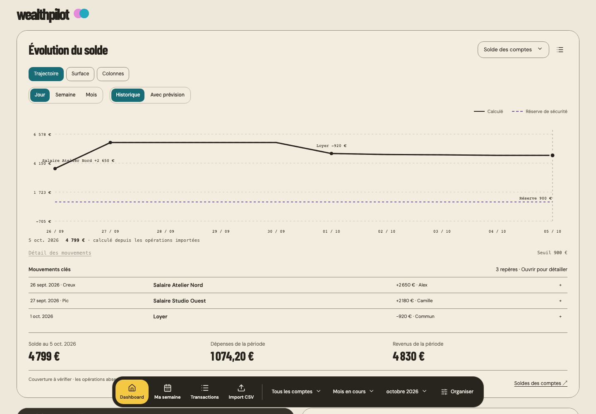
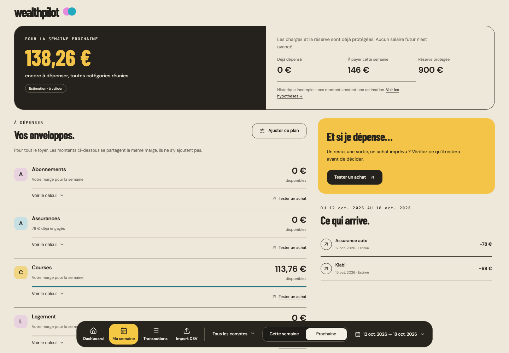
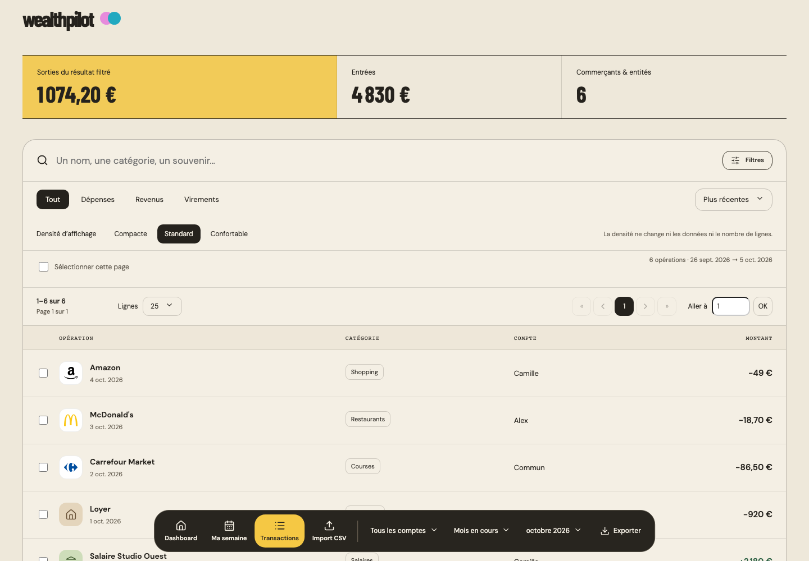
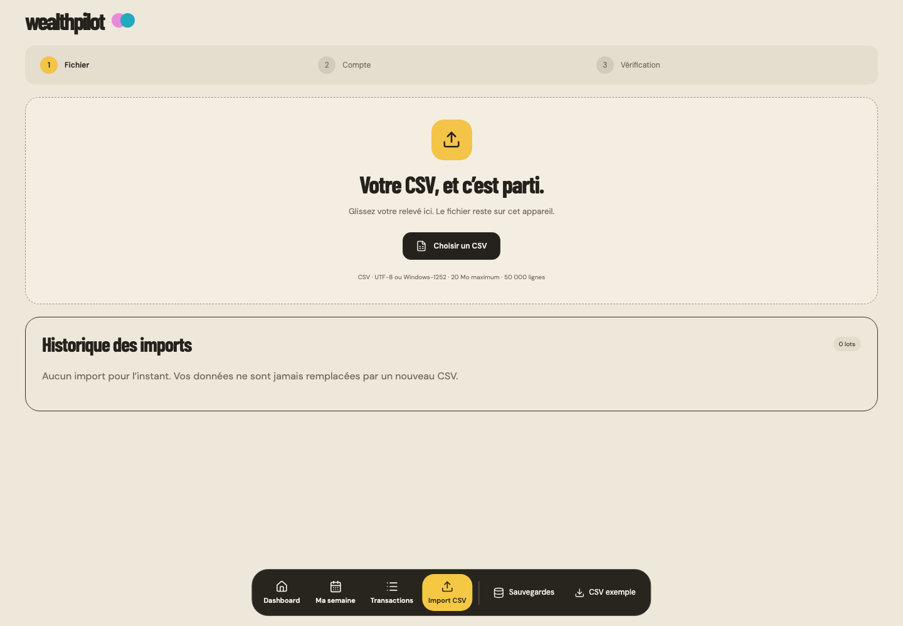

# WealthPilot — Passation technique et produit

État arrêté au 5 octobre 2026 • Document de travail pour revue senior

### Objet de la passation

Donner à un tech lead une lecture autonome du produit, du code réellement présent, des décisions successives, des résultats vérifiés et des risques. Ce document prépare une revue et une reprise ultérieure ; il ne constitue ni une validation de mise en production ni une promesse de conformité à toutes les maquettes.

### État à retenir immédiatement

- Développement en pause à la demande du propriétaire. Aucune fonctionnalité n’a été modifiée pour ce rapport ; seules des vérifications et des captures sur données fictives ont été réalisées.
- L’application courante est la SPA React/Vite dans apps/wealthpilot. L’application Next.js à la racine est un héritage distinct, à ne pas confondre avec elle.
- Risque de transmission majeur : aucun fichier de apps/wealthpilot n’est suivi dans le commit actuel. Le travail actif existe sur disque, pas dans le seul historique Git.
- Compilation et typage réussis. Suite globale : 344 réussites, 1 échec, 1 test privé ignoré. Le défaut de concurrence sur les échéances est conservé et expliqué.
- Quatre pages autorisées : Dashboard, Ma semaine, Transactions, Import CSV. Les objectifs sont retirés de l’interface ; Ma semaine et les visualisations ne sont pas validés au niveau produit demandé.

### Niveau de confiance

Les preuves sont séparées en trois catégories : constat direct du code et des essais du jour ; historique consigné dans le brief ; recommandation de revue. Aucun score global de 95/100 n’est attribué. Les captures montrent une exécution réelle, mais ne prouvent ni l’exactitude de tout jeu de données ni la qualité de tous les gestes.

Les images de recette utilisent uniquement des comptes fictifs. Aucun relevé bancaire privé, secret API ou export de la base utilisateur n’est incorporé au document.

<a id="toc"></a>

## Guide de lecture

Lecture rapide : synthèse initiale, résultats de vérification, défaut connu, priorités de revue. Lecture complète : suivre les rubriques ci-dessous. Chaque entrée est un lien interne au document.

- [01 Intention produit et historique des décisions](#product)
- [02 Stack réellement utilisée](#stack)
- [03 Dépôt et démarrage reproductible](#repo)
- [04 Architecture et responsabilités](#architecture)
- [05 Données locales et sauvegardes](#data)
- [06 Import CSV et intégrité du ledger](#importlogic)
- [07 Mois budgétaires détectés sur les revenus](#periods)
- [08 Soldes et prévisions](#finance)
- [09 Plan hebdomadaire et simulation](#weekly)
- [10 Dashboard exécuté](#dashscreen)
- [11 Ma semaine exécutée](#weekscreen)
- [12 Transactions exécutées](#txscreen)
- [13 Import exécuté](#importscreen)
- [14 Grille et réactivité](#grid)
- [15 Inventaire des composants de synthèse](#catalog1)
- [16 Inventaire des composants de décision](#catalog2)
- [17 Inventaire des composants restants](#catalog3)
- [18 Direction visuelle et archives](#visual)
- [19 Vérifications du 5 octobre](#qa)
- [20 Échec conservé et limites de recette](#failure)
- [21 Revue technique prioritaire](#review)
- [22 Écarts produit et travaux différés](#backlog)
- [23 Conditions de reprise et critères de sortie](#resume)
- [24 Sources et dossier à transmettre](#sources)

Convention : les chemins de modules sont relatifs à apps/wealthpilot/src, sauf précision contraire. Les noms entre guillemets décrivent l’interface, pas une nouvelle fonctionnalité à développer.

<a id="product"></a>

## 01 Intention produit et historique des décisions

### Le besoin stable

WealthPilot doit aider un foyer à décider combien dépenser maintenant et la semaine prochaine, après charges, réserves et besoins courants. Ce n’est ni une app crypto ni un agrégateur bancaire connecté. L’entrée principale est un CSV importé régulièrement ; les comptes personnels et le compte commun doivent rester distinguables, tout en permettant une vue foyer.

Le dashboard doit être modulaire et utile : plusieurs tailles, des sources configurables, des représentations propres au sens du composant, une disposition manipulable directement et des actions qui fonctionnent. Le style retenu est inspiré de Rime : papier chaud, charbon, titres condensés, accents francs. Une déclinaison de couleurs seule ne constitue pas une nouvelle visualisation.

### Ce qui a changé pendant les itérations

| Période | Travail et décision à retenir |
| --- | --- |
| 30 septembre | Analyse de l’existant Next.js et du prototype ; volonté de reconstruire sans perdre les données et objectifs historiques. |
| 1–2 octobre | Explorations visuelles, direction Rime, 30 planches de composants et 14 pages conceptuelles. Ce sont des références, non 14 pages encore autorisées. |
| 3–4 octobre | Tranche React/Vite : import, dashboard, transactions, calculs et semaine. Extensions fonctionnelles, grille, palettes, logos et récupération historique. |
| 5 octobre | Recentrage explicite sur 4 pages. Retrait des présentations d’objectifs. Logo seul en haut ; navigation et actions dans le dock. |
| Dernière correction | Le choix d’un jour fixe de cycle est rejeté. Les périodes sont calculées sur les revenus réellement reçus, avec dates variables. |
| Présent rapport | Arrêt du développement et passation à un tech lead. Pas de nouvelle livraison fonctionnelle. |

### Ne pas effacer les désaccords

Les retours utilisateur invalident les anciennes appréciations enthousiastes et les notes 95–100. Les critiques récurrentes portent sur les déplacements, les tailles, les scrolls internes, les visualisations trop génériques et le manque de sens de certains chiffres. Une correction technique ciblée n’équivaut pas à une acceptation générale du produit.

Le brief est un journal cumulatif : sa section 28 remplace le réglage de cycle de la section 27. Les demandes les plus récentes priment sur les anciennes ambitions de navigation et sur les maquettes.

<a id="stack"></a>

## 02 Stack réellement utilisée

Application active : wealthpilot-next 0.1.0, modules ES, interface locale. Les versions ci-dessous proviennent du package courant et, pour les bibliothèques principales, de l’installation examinée le 5 octobre.

| Couche | Technologie | Responsabilité |
| --- | --- | --- |
| Interface | React / React DOM 19.2.3 | Rendu, composants, état et hooks |
| Langage | TypeScript 5.9.3 | Mode strict ; cible ES2022, résolution bundler |
| Build | Vite 7.3.6 | Dev local, build statique et worker |
| Persistance | Dexie 4.2.1 | IndexedDB locale et transactions atomiques |
| Réactivité DB | dexie-react-hooks 4.2.0 | useLiveQuery sur les snapshots |
| CSV | PapaParse 5.5.3 | Parsing ; règles métier propres au projet |
| Disposition | react-grid-layout 2.2.2 | Placement, collision, drag et redimensionnement |
| Contrôles | Radix Dialog 1.1.15 / Select ^2.3.7 | Primitives de dialogue et sélection |
| Icônes | Lucide 0.562.0 / Simple Icons 16.33.0 | Replis sémantiques et logos locaux |
| Typographie | Barlow Condensed / DM Sans 5.2.8 | Polices fournies localement via Fontsource |
| Styles et graphes | CSS spécifique / React et SVG | Pas de Tailwind ni Recharts requis par la SPA |
| Tests | Vitest 4.1.11 / jsdom 27.4.0 | Tests calculs, persistance et composants |
| Fausse DB | fake-indexeddb 6.2.5 | Isolement des tests de stockage |
| Recette UI | Playwright, dépendance racine | Scripts Chromium, captures et certaines vidéos |
| Formatage | Prettier 3.6.2 | Formatage ; pas une validation fonctionnelle |

### Ce qui ne fait pas partie du runtime actif

Pas de backend, d’authentification serveur, de synchronisation cloud ni de connexion bancaire observés dans cette tranche. Les modules intelligence, prévision et reconnaissance sont des heuristiques TypeScript locales, pas un LLM. Le script local-ai de la racine appartient à l’héritage ; il ne faut pas en déduire une dépendance IA de la SPA.

Héritage racine : Next.js 16.1.3, React 19.2.3, Tailwind 4, Recharts 3.6.0 et nombreuses primitives Radix. Il dispose de ses propres scripts et configurations. La version 0.15.0 du paquet racine ne décrit pas le niveau de maturité de la nouvelle application.

<a id="repo"></a>

## 03 Dépôt et démarrage reproductible

### Localisation et état Git

```text
/Users/anthonny.olime/Personal_Repos/Perso/Account/wealthpilot
```

Branche main. HEAD examiné : 86bcc7a0f9b2d237e8d0be575b65cd449466e9eb. L’arbre de travail est sale : fichiers racine modifiés et répertoires actifs non suivis. git ls-files apps/wealthpilot renvoie zéro fichier. Un reviewer travaillant uniquement sur HEAD ne reverra pas le produit montré ici.

| Zone | Rôle et précaution |
| --- | --- |
| apps/wealthpilot | Application active et scripts de recette ; non suivis au moment du rapport. |
| src et fichiers racine | Ancien produit Next.js ; le conserver tant que la migration des données n’est pas sécurisée. |
| specs/rebuild | Prototype HTML/JS et tests antérieurs ; distinct du runtime Vite. |
| design et images_ref | Sources des maquettes et références ; design est non suivi actuellement. |
| tmp | Rapports et captures de travail ignorés par Git ; preuves non récupérables par clone. |
| ../data | CSV privé consolidé, hors dépôt ; ne pas le rendre public pour transmettre le code. |

### Démarrage normal depuis la racine

```sh
npm ci
npm --prefix apps/wealthpilot ci
npm run dev:pilot
# Application : http://127.0.0.1:5173
```

Le README recommande Node 22.12 ou supérieur ; les essais du rapport ont utilisé Node 24.20.0. Le simple npm run dev démarre l’ancien Next.js, pas la SPA. Les dépendances racine sont nécessaires aux scripts Playwright actuels. Les pré-scripts dev/build génèrent logos et références : examiner ce qu’ils copient avant publication.

### Vérification sans resynchroniser les références

```sh
cd apps/wealthpilot
npx tsc --noEmit
npx vitest run
npx vite build
```

Ces commandes ont été exécutées pour ce rapport. Le build actualise uniquement la sortie ignorée dist ; aucun déploiement n’a eu lieu. Ne pas lancer format --write, une migration ou une suppression de base comme préalable implicite à la revue.

<a id="architecture"></a>

## 04 Architecture et responsabilités

### Parcours de la donnée

Fichier local → worker de parsing → aperçu et affectation de compte → écriture Dexie atomique → snapshot réactif → calculs de domaine partagés → composants des quatre pages. Une édition modifie les données ou préférences, puis invalide les sélecteurs concernés ; elle ne doit pas recharger toute la page.

| Module ou groupe | Responsabilité principale |
| --- | --- |
| main.tsx et App.tsx | Initialisation, hash de navigation, compte et période partagés, pages visitées conservées montées. |
| navigation.ts et productScope.ts | Quatre routes actives et retrait des anciennes familles d’objectifs sans invalider leurs sauvegardes. |
| PageActions.tsx et Dock.tsx | Actions de la page rendues dans le dock ; état conservé dans la page propriétaire. |
| store.ts et useSnapshot.ts | Schéma DB, import/annulation/restauration, lecture cohérente et identité stable des tableaux non modifiés. |
| importer.ts et import.worker.ts | Décodage, parsing, mapping, métadonnées, prévisualisation, erreurs et progression. |
| periods.ts et transactionIdentity.ts | Calendrier de revenus commun au foyer et normalisation des identités de contreparties. |
| domain.ts et forecasting.ts | Soldes, agrégats, enveloppes, cash futur, semaine et simulation d’achat. |
| intelligence.ts et financialView.ts | Récurrences, estimation, reprise ancienne et cache des résultats financiers. |
| layout.ts et DashboardBoard.tsx | Instances, vues, dispositions, brouillon d’organisation, mesures et interactions de grille. |
| Dashboard.tsx et Chart.tsx | Assemblage des cartes, trajectoire du solde et explication des mouvements. |
| InsightWidget et renderers | Variantes et modules additionnels ; registre de contrats et de représentations. |
| TransactionsPage / WeekPage / ImportPage | Parcours métier spécifiques et commandes inline. |

### Points d’attention de conception

Les frontières UI/métier existent, mais les gros composants regroupent encore de nombreuses responsabilités. domain et forecasting se référencent mutuellement ; la compilation réussit, mais les dépendances méritent une lecture avant extraction. La séparation de la présentation et des calculs est une intention à vérifier sur chaque chemin, pas une architecture entièrement normalisée.

<a id="data"></a>

## 05 Données locales et sauvegardes

### Modèle persistant

Base IndexedDB WealthPilotNext_v1, schéma Dexie version 1. L’argent est stocké en centimes entiers ; les dates métier sont des chaînes ISO YYYY-MM-DD. L’absence de solde connu doit rester une absence, et non devenir arbitrairement zéro.

| Table | Contenu et points sensibles |
| --- | --- |
| transactions | ID, lot, compte, date, montant, libellé, marchand, catégorie, indicateur interne, empreinte, données brutes et corrections. |
| accounts | ID et identifiant bancaire éventuel ; checkpoints datés ; plages de couverture de relevés. |
| batches | Empreinte unique du fichier, dates, volume, métadonnées et IDs des opérations importées. |
| budgets | Montant par catégorie, mois budgétaire nommé et éventuellement compte ; pas une opération bancaire. |
| dues | Échéances positives ou négatives, date, compte, provenance, occurrence récurrente et statut estimé. |
| preferences | Réserves, vues et layouts, tailles, couleurs, règles, plans hebdomadaires et champs historiques conservés. |

### Observations de solde et couverture

Un checkpoint distingue un solde observé et un solde dérivé ; il peut porter une provenance de fichier/lot et une acceptation. La couverture du relevé ne prouve pas qu’aucune opération ne manque entre deux observations. L’interface doit expliciter cette incertitude. Une reconstruction peut afficher un écart d’ajustement lorsqu’une observation bancaire contredit la somme des mouvements.

### Sauvegarde et confidentialité

L’export JSON versionné contient les tables et préférences. La restauration validée remplace les tables au sein d’une transaction ; ce n’est pas une fusion anodine. Un CSV des transactions ne suffit pas à préserver vues, réserves, règles, checkpoints et plans. Avant toute reprise, sauvegarder la base utilisateur hors du dépôt et tester sa restauration dans un profil isolé.

Le stockage dépend de l’origine, du navigateur et du profil : localhost et 127.0.0.1, ou les ports 5173 et 5201, ne partagent pas une base. Les exports ne sont pas chiffrés par l’application. Ne pas conclure à une sauvegarde durable simplement parce que les données restent après un rechargement.

La reprise des anciens objectifs/budgets est explicite, depuis l’ancienne base accessible à la même origine ou un export compatible. Aucune migration universelle de toutes les anciennes tables n’est démontrée. Aucune collecte Notion ou iOS n’a été prouvée pour cette passation.

<a id="importlogic"></a>

## 06 Import CSV et intégrité du ledger

### Parcours prévu et implémentation

Pour un format reconnu : dépôt → détection des colonnes → choix d’un compte existant ou nouveau → aperçu → validation. Le petit dialogue de compte est l’exception explicitement acceptée à la préférence générale pour les éditions inline. Le mapping reste un recours pour les fichiers inconnus ou ambigus, pas une étape imposée à chaque CSV.

Le worker décode l’UTF-8 puis prévoit un repli Windows-1252. PapaParse lit les lignes ; le projet reconnaît les en-têtes et les métadonnées SG, convertit dates et montants, puis expose erreurs et progression. L’interface annonce 20 Mo et 50 000 lignes au maximum : cette limite de produit n’est pas une mesure de performance validée à cette charge.

### Garde-fous métier

- Date valide, compte et libellé utilisables, montant cohérent ; prise en charge montant signé ou débit/crédit. Deux colonnes débit et crédit simultanément non nulles sont rejetées plutôt qu’interprétées au hasard.
- Devise EUR uniquement. Un relevé multicomptes ne doit pas être aplati ; l’identifiant bancaire déjà reconnu protège l’affectation du compte.
- Un SHA-256 de fichier prévient la réimportation du même lot. L’empreinte d’opération combine compte, date, montant et libellé normalisé ; les occurrences sont comptées pour préserver plusieurs dépenses réellement identiques.
- L’état de la base au moment de l’aperçu est vérifié avant commit. Une base modifiée entre aperçu et validation ne doit pas recevoir silencieusement une décision calculée sur un ancien état.
- Choisir un nouveau compte ne le crée pas immédiatement. Compte, lot et transactions sont écrits lors de la confirmation finale. Annuler avant cette étape ne crée rien.
- Annuler un import utilise sa provenance. Le retrait d’un lot contenant des opérations corrigées est bloqué pour ne pas effacer ces corrections sans examen.

### Ce qui reste à vérifier avec le reviewer

La reconnaissance n’est pas universelle. Un nouveau format bancaire peut demander une règle ou une correction manuelle. Les tests ne prouvent pas l’exhaustivité des doublons entre tous les exports de toutes les banques. Réexaminer en priorité les collisions d’empreinte, les relevés qui se chevauchent et les soldes affichés dans les métadonnées de début/fin.

Le CSV consolidé privé demeure hors dépôt. Le test dédié contrôle 1 508 lignes et trois comptes sur le snapshot connu ; il ne valide pas la complétude des relevés réels ni les soldes bancaires du jour. Ce test est ignoré si la variable de chemin privée n’est pas fournie.

<a id="periods"></a>

## 07 Mois budgétaires détectés sur les revenus

### Règle produit à préserver

Le mois budgétaire ne commence pas à un jour fixe choisi dans une liste. Il commence au premier revenu régulier effectivement constaté pour la vague mensuelle du foyer. Un salaire reçu fin septembre peut ouvrir « octobre » ; celui reçu fin août ouvre « septembre ». Leurs dates peuvent différer. La frontière historique est la date réelle, jamais le 26 imposé à tous les mois.

Plusieurs comptes partagent le même calendrier. Filtrer un compte change les montants, pas les bornes du foyer. La période historique se termine la veille du prochain revenu qui ouvre la période suivante. Sans nouvelle entrée identifiable, la période reste ouverte. Les jours précédant la première paie connue restent consultables comme historique initial partiel.

### Comment periods.ts le détermine

- Ne considérer que des crédits externes réalisés à la date d’observation ; exclure virements internes, remboursements, avoirs, avances, primes isolées et titres-restaurant.
- Reconnaître les revenus explicites via libellé, catégorie et champs bruts : salaires, pensions, allocations/CAF notamment. Une autre source requiert au moins trois dates avec cadence mensuelle suffisamment régulière.
- Grouper par compte et identité de contrepartie. La première phase observée sert à nommer le mois financé : première moitié du mois ou seconde moitié. Les arrivées décalées autour de la fin de mois sont rattachées à la vague la plus proche.
- Prendre la date la plus précoce de la vague parmi les comptes. Le rattachement d’une occurrence utilise son historique disponible, pas les versements futurs pour réécrire rétroactivement les périodes.
- Estimer les prochaines frontières séparément à partir de la cadence ou d’un revenu futur déjà renseigné. Elles ne deviennent pas des mois historiques avant réalisation. Une CAF isolée ne suffit pas à projeter une série.

### Incertitudes à ne pas masquer

Le nom du mois financé reste une inférence. Un employeur inconnu avec un libellé vague et un seul versement peut échapper à la détection. En l’absence totale de revenu identifiable, le repli sur le mois civil est provisoire et doit être présenté ainsi. Les revenus très irréguliers nécessitent des cas de revue supplémentaires.

L’ancien champ cycleStartDay est accepté pour lire les sauvegardes mais ignoré dans le calcul. Son menu a été retiré. La sélection historique masque les périodes futures, et une ancienne préférence future est ramenée à la période disponible. Les dates effectives et la frontière estimée sont accessibles dans le sélecteur, au clavier et sur mobile.

<a id="finance"></a>

## 08 Soldes et prévisions

### Solde bancaire et flux ne sont pas interchangeables

balanceAt part d’une observation datée C. Vers le futur, il ajoute les opérations après la date de C jusqu’à J ; vers le passé, il soustrait celles après J jusqu’à C. Il n’invente pas un solde d’ouverture à zéro à chaque filtre. Les virements internes affectent chaque compte, mais ne sont pas des revenus ou dépenses du foyer.

```text
J ≥ date(C) : solde(J) = C + somme des mouvements ]date(C), J]
J < date(C) : solde(J) = C − somme des mouvements ]J, date(C)]
```

selectDashboard applique compte, plage et date d’observation de façon cohérente. Les opérations importées mais datées dans le futur ne sont pas des dépenses payées ou revenus acquis. Le graphique garde des mouvements explicatifs, notamment les deux salaires d’un foyer, les grosses baisses et les ajustements au solde confirmé.

### Prévision et disponible

forecastCash sépare trésorerie, échéances, réserves et consommation variable encore prévue. Il traite les récurrences positives comme négatives et déduplique les événements connus face aux événements estimés. La réserve de sécurité et l’argent déjà affecté aux projets ne sont pas des mouvements bancaires supplémentaires.

Pour une enveloppe, la provision libre est max(0, alloué − payé − déjà engagé). Exemple purement illustratif : 600 € alloués, 200 € déjà payés et 100 € engagés laissent 300 € de variable à provisionner. Retrancher 400 € puis encore les 100 € engagés compterait ces derniers deux fois.

Un disponible négatif peut être correct si les engagements et réserves dépassent la marge. Il ne doit ni être arbitrairement ramené à zéro ni être accepté sans décomposition vérifiable. Les réserves communes ne doivent pas être réparties silencieusement sur les comptes individuels.

### Représentation temporelle

Jour, semaine et mois agrègent des soldes de clôture, pas la somme des soldes. « 30 derniers jours » utilise des dates glissantes exactes ; les sélections de mois utilisent les frontières de revenus. L’historique et la prévision sont distincts, la seconde devant être activée explicitement dans le graphique.

La fourchette future est un scénario construit à partir de variations et hypothèses de dépenses, pas un intervalle de confiance statistique. Un horizon graphique plus court ne doit pas modifier les montants des dates communes. Les lacunes de données et l’absence de prochaine paie identifiable restent des avertissements, non des garanties.

### Détection des échéances récurrentes

intelligence.ts examine 370 jours et jusqu’à huit occurrences récentes par compte, contrepartie et signe. Il exige au moins trois dates distinctes, une cadence mensuelle de 25–35 jours ou hebdomadaire de 5–9 jours et des montants suffisamment stables ; une exception positive peut être tolérée. Les anciennes séries inactives sont écartées. Les règles confirmées, pauses et occurrences ignorées modifient cette projection. Ce moteur d’échéances est distinct du calendrier de périodes : ils ne partagent pas exactement les mêmes seuils de détection. Les scores 65/70/90 de confiance sont heuristiques, non des probabilités calibrées.

<a id="weekly"></a>

## 09 Plan hebdomadaire et simulation

### Question à résoudre

Combien peut-on encore consacrer aux courses, aux restaurants, au transport ou à un achat cette semaine, sans compromettre les charges à venir ? La réponse doit suivre le compte sélectionné ou le foyer entier. Le salaire attendu plus tard ne peut pas financer artificiellement une dépense aujourd’hui.

### Calcul existant

forecasting.ts construit un plan hebdomadaire à partir des dépenses historiques comparables, des enveloppes disponibles, des engagements datés et de la capacité de trésorerie. Les médianes de semaines servent de repère ; les limites, réduction et réserve d’un plan peuvent être sauvegardées par début de semaine et compte.

La chronologie compte autant que le total : une semaine positive à son dernier jour peut passer dans le rouge avant une paie. Le plan doit donc tenir compte des échéances intermédiaires. Lorsque la semaine traverse plusieurs mois budgétaires, les parts disponibles sont réparties sur les jours concernés pour ne pas compter deux allocations complètes.

Le périmètre des budgets est explicite : une enveloppe commune ne se cumule pas avec ses équivalents individuels dans le total foyer. Le choix d’un compte ne doit pas inventer une quote-part de cette enveloppe sans règle de répartition.

### Test d’achat

simulatePurchase compare la situation avant/après selon date, montant, catégorie et compte. Une dépense prévue dans une enveloppe consomme cette enveloppe ; elle ne doit pas diminuer une seconde fois une projection qui suppose déjà sa consommation totale. Une dépense additionnelle hors enveloppe réduit bien la marge future. Aucun virement ou paiement réel n’est déclenché.

### Limites de la version actuelle

- La page existe et expose les enveloppes, échéances, hypothèses et simulation, mais sa composition a été jugée insuffisante par l’utilisateur. Elle ne doit pas être présentée comme une maquette validée.
- Une répétition historique peut produire une fausse récurrence : les captures fictives du rapport font volontairement apparaître le besoin d’expliquer et contester une estimation, pas de la présenter comme certaine.
- Les plans dépendent de la qualité des libellés, catégories, observations de solde et périodes couvertes. Il ne s’agit pas d’un conseil financier certifié ni d’une garantie de rester dans le vert.

La refonte visuelle doit reprendre après revue et choix d’une direction. Dix compositions différentes ont été spécifiées dans le brief ; leurs images n’ont pas été générées dans l’état contrôlé.

<a id="dashscreen"></a>

## 10 Dashboard exécuté



*Figure 1 — Dashboard exécuté le 5 octobre 2026, fenêtre 1440 × 1000, données fictives. Capture du premier écran ; les cartes suivantes sont plus bas dans la page.*

### Ce que montre cet état

Logo seul, filtre de compte et période dans le dock, graphique à granularité choisie, distinction historique/prévision, repères de mouvements et accès à leur détail. La présence de deux revenus dans la liste ne signifie pas que toutes les annotations sont affichées simultanément sur la courbe.

### Lecture critique

Le graphe par défaut occupe presque toute la première fenêtre. Cela peut nuire à la synthèse immédiate et à la densité du dashboard : un résultat de mesure sans débordement ne valide pas ce choix. Le positionnement, l’ouverture des détails et les changements de taille restent à évaluer avec l’utilisateur sur écran 14 pouces et écran 4K.

La capture est un état exécuté, non une nouvelle proposition de design. Elle ne prétend pas représenter les soldes du foyer réel.

<a id="weekscreen"></a>

## 11 Ma semaine exécutée



*Figure 2 — Ma semaine exécutée le 5 octobre 2026, données fictives. Ici la semaine prochaine est sélectionnée ; seule la première fenêtre de la page est montrée.*

### Fonctions visibles

Marge hebdomadaire, charges attendues, réserve, enveloppes, ajustement du plan, simulation d’achat et changement de semaine dans le dock. Les mentions d’estimation et de couverture sont conservées pour ne pas présenter des hypothèses comme des opérations connues.

### Réserve produit explicite

Cette page reste une base contestée, pas la future direction approuvée. La liste peut mélanger des catégories actionnables et des lignes à zéro ; la hiérarchie et la clarté de « combien dépenser aujourd’hui » méritent une reprise. Le faux foyer a un achat Kiabi chaque mois : l’estimation illustre qu’une cadence détectée n’est pas forcément une charge obligatoire.

Les boutons Cette semaine / Prochaine sont des états de sélection. Leur existence et leur style commun ne suffisent pas à prouver tous les états clavier, tactile, chargement et erreur.

<a id="txscreen"></a>

## 12 Transactions exécutées



*Figure 3 — Transactions exécutées, données fictives, fenêtre 1440 × 1000. Recherche, filtres, densité et pagination sont visibles sans devoir atteindre le bas de la liste.*

### Implémentation utile à conserver

Pagination 25, 50, 75, 100 ou 150 lignes, accès direct à une page, contrôles haut/bas, trois densités, tri et filtres. Les corrections et détails sont inline. La vérification manuelle des opérations n’est plus un travail imposé ; un champ historique reste toléré dans les sauvegardes.

search.ts normalise accents et ponctuation puis combine exact, préfixe, sous-chaîne, distance de caractères et abréviation ordonnée. Cela permet des recherches proches de « mcdo » sans base géante de synonymes. Tous les termes doivent avoir une correspondance ; ce n’est pas une recherche sémantique IA.

Les logos viennent d’actifs locaux et de règles de marchands ; sinon une icône/couleur de catégorie ou sous-catégorie prend le relais. Il n’est pas démontré que chaque commerçant de chaque relevé réel dispose du bon logo.

<a id="importscreen"></a>

## 13 Import exécuté



*Figure 4 — Premier accès sans données, redirection vers Import CSV dans un profil de test vide. Aucun compte utilisateur n’a été effacé pour produire cette image.*

### État vide et accès aux sauvegardes

Le parcours commence directement par le fichier. La navigation reste accessible et les actions spécifiques Import apparaissent après le séparateur du dock, dont Sauvegardes et CSV exemple. Le CSV exemple n’est pas le CSV privé consolidé.

L’étape de vérification correspond à l’aperçu d’import et aux problèmes de format, pas à l’ancienne colonne de pointage manuel dans Transactions. Cette distinction doit rester explicite pour éviter une nouvelle ambiguïté produit.

### Ce que l’image ne prouve pas

Cette capture ne montre pas toutes les branches de mapping, les erreurs, les doublons, la reprise de solde ou l’annulation d’un lot. Les garde-fous sont décrits dans le chapitre Import et couverts partiellement par les tests. Aucun test de charge à la limite de 50 000 lignes n’a été ajouté pendant la passation.

<a id="grid"></a>

## 14 Grille et réactivité

### Modèle de grille actuel

Le modèle contient des vues, chaque vue portant ses instances et des layouts par classe de largeur. Chaque instance conserve type, taille, palette, source, période, représentation et options propres. Le placement utilise 24 colonnes logiques et une unité verticale de 12 px. Les seuils de largeur sont 1 700 px pour desktop et 2 600 px pour wide ; un ordre mobile est également conservé.

| Taille | Largeur logique laptop | Hauteur initiale en unités |
| --- | --- | --- |
| Mini | 6 / 24 | 14 |
| Petit | 8 / 24 | 22 |
| Moyen | 12 / 24 | 28 |
| Grand | 16 / 24 | 36 |
| Très grand | 24 / 24 | 44 |

Les autres breakpoints réduisent les largeurs relatives ; la hauteur finale est mesurée à partir du contenu. Les tailles sont des niveaux d’information, pas cinq boîtes rigides. Une taille plus étroite peut garder une hauteur importante si le texte se replie. Les poignées verticales ont été retirées pour ne pas promettre une hauteur libre qui ne serait pas conservée.

### Déplacement et compactage

Poignée de drag, empreinte cible en pointillés, déplacement des voisines et alternative clavier sont présents. La version récente compacte verticalement après réduction ou fermeture tout en préservant les colonnes. Cela remplace une intention antérieure de conserver tous les espaces vides : la politique doit être revue avec le dernier feedback, pas déduite d’un ancien paragraphe du brief.

L’organisation dispose d’un brouillon, d’une sauvegarde et d’une annulation. Les préférences de source, période et représentation sont distinctes du contenu calculé. La qualité du drag reste une question de sensation et de compréhension : il faut tester une prise réelle, le bord de fenêtre, la collision, l’annulation et le rechargement, pas seulement l’ordre final du tableau de positions.

### Réactivité et points à profiler

Les pages visitées sont conservées montées ; les mesures de largeur sont resynchronisées avant peinture. useSnapshot conserve l’identité des tableaux inchangés, et financialView exclut les préférences purement visuelles de ses clés financières. Le cache est borné. En revanche, une lecture atomique et des signatures JSON sur les tables restent proportionnelles au volume : profiler avant de promettre une latence instantanée à grande échelle.

<a id="catalog1"></a>

## 15 Inventaire des composants de synthèse

Inventaire du code, pas certificat de qualité. XS = Mini, S = Petit, M = Moyen, L = Grand, XL = Très grand. Le défaut runtime est M, sauf le graphique en XL. Les tailles des anciennes planches ne sont pas toujours les défauts du code.

| Composant | Question du contrat | Tailles | Représentations déclarées |
| --- | --- | --- | --- |
| Évolution du solde<br>chart | Quand le solde monte-t-il, baisse-t-il ou devient-il risqué ? | M L XL | Courbe, Aire, Colonnes |
| Disponible à dépenser<br>available | Quelle marge reste après les engagements et réserves ? | XS S M L XL | Rendu natif ; registre générique « Lignes » |
| Solde du foyer<br>balance | Combien possédons-nous à cette date ? | XS S M L XL | Lignes, Anneaux, Répartition, Tuiles |
| Vos budgets<br>budgets | Que reste-t-il dans chaque enveloppe de la période ? | S M L XL | Lignes, Anneaux, Colonnes, Tuiles |
| Échéances à venir<br>dues | Quels mouvements sont attendus avant la fin du cycle ? | S M L XL | Rendu natif ; registre générique « Lignes » |
| Opérations<br>transactions | Quelles opérations expliquent cette période ? | S M L XL | Rendu natif ; registre générique « Lignes » |
| Source et fraîcheur<br>sources | Mes soldes et relevés sont-ils assez récents pour décider ? | XS S M L XL | Rendu natif ; registre générique « Lignes » |
| Disponible cette semaine<br>weekly | Combien reste-t-il par catégorie cette semaine ? | XS S M L XL | Rendu natif ; registre générique « Lignes » |
| Point bas prévisionnel<br>low | Quel est le jour le plus fragile du cycle ? | XS S M L XL | Rendu natif ; registre générique « Lignes » |
| Revenus et dépenses<br>flows | Les revenus de la période couvrent-ils ses dépenses ? | XS S M L XL | Lignes, Colonnes, Cascade |

Les filtres ne sont proposés que lorsqu’ils changent la réponse de la carte. Le contrat distingue compte/foyer et période/plage/date limite/temps présent. Disponible et fonds de sécurité portent notamment des contraintes de réserves du foyer.

<a id="catalog2"></a>

## 16 Inventaire des composants de décision

Inventaire du code, pas certificat de qualité. XS = Mini, S = Petit, M = Moyen, L = Grand, XL = Très grand. Le défaut runtime est M, sauf le graphique en XL. Les tailles des anciennes planches ne sont pas toujours les défauts du code.

| Composant | Question du contrat | Tailles | Représentations déclarées |
| --- | --- | --- | --- |
| Puis-je dépenser ?<br>purchase | Cet achat compromet-il mes prochaines échéances ? | XS S M L XL | Rendu natif ; registre générique « Lignes » |
| Scénarios du mois<br>scenario | Quel effet aurait un changement mensuel de charges ou de revenus ? | M L XL | Rendu natif ; registre générique « Lignes » |
| Fonds de sécurité<br>safety | Le foyer reste-t-il au-dessus de son minimum de sécurité ? | XS S M L XL | Rendu natif ; registre générique « Lignes » |
| Santé des comptes<br>accounts | Quels comptes sont à découvert ou doivent être actualisés ? | S M L XL | Rendu natif ; registre générique « Lignes » |
| Charges du foyer<br>charges | À quelles dates faut-il garder l’argent des charges restantes ? | XS S M L XL | Lignes, Échéancier, Tuiles |
| Compte à approvisionner<br>funding | Quel compte faudra-t-il approvisionner et avant quelle date ? | XS S M L XL | Rendu natif ; registre générique « Lignes » |
| Dépenses par compte<br>paidBy | Quels comptes supportent les dépenses du foyer ? | XS S M L XL | Lignes, Répartition, Mosaïque |
| À catégoriser<br>uncategorized | Quelles opérations ont besoin d’être classées ? | XS S M L XL | Lignes, Tuiles |
| Récurrences détectées<br>recurring | Quelles cadences détectées dois-je confirmer ou ignorer ? | S M L XL | Lignes, Colonnes, Tuiles |
| Répartition des dépenses<br>categories | Quels usages absorbent les dépenses de la période ? | S M L XL | Lignes, Anneaux, Répartition, Mosaïque, Tuiles |

Ces noms ne garantissent pas dix expériences réellement distinctes. Une représentation réutilisée peut être valide graphiquement mais redondante au niveau produit. La revue doit comparer les décisions permises, la donnée source et l’action, pas uniquement la forme affichée.

<a id="catalog3"></a>

## 17 Inventaire des composants restants

Inventaire du code, pas certificat de qualité. XS = Mini, S = Petit, M = Moyen, L = Grand, XL = Très grand. Le défaut runtime est M, sauf le graphique en XL. Les tailles des anciennes planches ne sont pas toujours les défauts du code.

| Composant | Question du contrat | Tailles | Représentations déclarées |
| --- | --- | --- | --- |
| Rythme de dépenses<br>pace | À quel rythme ai-je réellement dépensé sur la période ? | XS S M L XL | Rendu natif ; registre générique « Lignes » |
| Dépenses inhabituelles<br>unusual | Quelles opérations dépassent mon historique comparable ? | XS S M L XL | Lignes, Tuiles |
| Comparaison des mois<br>comparison | Comment les mois se comparent-ils, à couverture connue ? | M L XL | Lignes, Tuiles, Colonnes |
| Configurer les blocs<br>configuration | Quelle disposition et quelles sources sont enregistrées ? | M L XL | Rendu natif ; registre générique « Lignes » |
| Bibliothèque et tailles<br>library | Quelle autre question puis-je ajouter à mon dashboard ? | M L XL | Rendu natif ; registre générique « Lignes » |
| Mon objectif<br>goal • RETIRÉ | Quelle est la prochaine étape de mon projet prioritaire ? | XS S M L XL | Rendu natif ; registre générique « Lignes » |
| Tous mes objectifs<br>goals • RETIRÉ | Quels projets progressent et lesquels nécessitent une décision ? | M L XL | Lignes, Anneaux, Tuiles, Cibles |
| Date d’achat estimée<br>goalDate • RETIRÉ | Quand l’effort prévu permettra-t-il de financer mes projets ? | XS S M L XL | Rendu natif ; registre générique « Lignes » |
| Effort d’épargne<br>effort • RETIRÉ | Mon effort mensuel suffit-il aux échéances de mes projets ? | XS S M L XL | Lignes, Anneaux, Tuiles, Cibles |
| Épargne des projets<br>savings • RETIRÉ | À quoi l’épargne déjà réservée est-elle affectée ? | XS S M L XL | Lignes, Anneaux, Répartition, Mosaïque, Tuiles |

Le registre historique contient 30 identifiants. Cinq familles liées aux objectifs sont retirées ; les 25 restantes comprennent deux utilitaires de configuration/bibliothèque. Il ne faut donc pas annoncer 30 widgets financiers finalisés. Les données et types retirés restent lisibles pour éviter une perte de sauvegarde.

Le registre de représentations ne décrit pas tous les états d’un composant : « Lignes » par défaut peut simplement être la valeur de repli technique. Une carte native de simulation ou d’alerte n’est pas nécessairement une liste de barres. Vérifier Dashboard, InsightWidget et NativeInsights conjointement.

<a id="visual"></a>

## 18 Direction visuelle et archives


*Figure 5 — Direction Rime conservée du 2 octobre. Image conceptuelle générée antérieurement ; montants illustratifs. Les objectifs figurant ici ont depuis été retirés de l’interface.*

Ce qui reste pertinent : papier/charbon, typographie condensée, accents jaune/rose/cyan, hiérarchie et graphiques explicatifs. Ce qui ne fait plus contrat : le slogan de header, la présence des objectifs et la fidélité automatique de chaque chiffre dessiné.

Le code propose 12 palettes complètes : Papier, Encre, Jaune, Rose, Cyan, Corail, Lavande, Prune, Bleu nuit, Sauge, Forêt et Sable. Le thème couvre fond, texte, surface secondaire, contour, focus et séries. Les calculs de contraste sont des garde-fous techniques ; ils ne prouvent pas l’équilibre esthétique de chaque carte.

<a id="qa"></a>

## 19 Vérifications du 5 octobre

Contrôles relancés le 5 octobre pour la passation. Les tests navigateur utilisent des contextes Chromium neufs sur le port 5201 et des données fictives. Aucun accès à la base personnelle du port 5173 n’a été nécessaire.

| Contrôle | Résultat observé | Portée réelle |
| --- | --- | --- |
| TypeScript | Réussi | npx tsc --noEmit ; cohérence statique, pas comportement runtime. |
| Build production | Réussi avec avertissements | 1 909 modules transformés ; chunk principal 507,43 kB, soit 153,85 kB gzip. |
| Vitest global | 344 OK / 1 échec / 1 ignoré | 51 fichiers : 49 réussis, 1 en échec, 1 ignoré. Durée locale ~7 s. |
| income-period-visual-qa | 20 / 20 contrôles réussis | Bornes de revenus variables, plusieurs comptes, persistance, dates accessibles, dock 390/1024/1440 px. |
| cycle-integration-qa | 28 / 28 contrôles réussis | Filtres, historique vs futur, agrégation du graphe, navigation, 390/820/1512/3840 px et retour mobile. |
| Captures de passation | 4 pages + état vide | Fenêtre 1440 × 1000 ; aucune erreur JS non interceptée observée dans ce scénario. |

### Avertissements conservés

Vite signale le chunk principal au-dessus de 500 kB minifiés. Le seuil n’a pas été augmenté pour masquer le message. Les directives use client de certains modules Radix sont ignorées pendant le bundling ; le build réussit. jsdom signale scrollTo non implémenté dans quelques tests : cela rappelle les limites de ce faux navigateur.

### Résultats historiques séparés

Le brief conserve d’autres recettes, notamment import 19/19, grille 26/26 et consultation d’opérations futures 9/9. Elles n’ont pas été relancées pour ce rapport et ne doivent pas être additionnées comme une couverture de l’ensemble du produit. Le contrôle privé du CSV est également distinct et non activé dans la suite globale du jour.

Les rapports JSON et images des deux parcours relancés restent dans tmp ; leurs scripts sont dans apps/wealthpilot/scripts. Les images du document ont été relues. Une capture statique n’atteste pas le comportement d’une animation ni toutes les combinaisons de tailles et variantes.

<a id="failure"></a>

## 20 Échec conservé et limites de recette

### Échec reproductible non corrigé

Test : component-contracts.test.tsx, ligne 386. Intitulé : « deux ajustements concurrents de la même occurrence estimée ne créent pas deux charges ». Le test attend une échéance et en obtient deux. Il échoue encore dans l’exécution globale du jour.

```sh
npx vitest run src/component-contracts.test.tsx
# AssertionError: expected 2 to be 1
# expect(await db.dues.count()).toBe(1)
```

Scénario : ouvrir la modification d’une occurrence estimée dans CalendarPage ; simuler une autre édition qui enregistre déjà cette occurrence ; sauvegarder depuis le premier état. Le résultat attendu est le refus du doublon avec un message invitant à rouvrir le calendrier. Le résultat obtenu est un deuxième enregistrement.

CalendarPage n’est plus une route active. Cela limite l’exposition du parcours visible mais n’efface pas le défaut du code conservé. Le reviewer doit déterminer si le même chemin d’écriture est utilisé ailleurs et examiner la contrainte d’unicité autour de originOccurrenceId dans la transaction. Cette cause précise n’a pas été corrigée ni définitivement attribuée pendant la passation.

### Ce que les réussites ne démontrent pas

- Pas de certification Safari/Firefox, VoiceOver natif, zoom extrême ou usage tactile prolongé sur appareils réels.
- Pas de couverture exhaustive de chaque composant × taille × palette × représentation × source × période.
- Pas de mesure de performance representative à 50 000 opérations, ni de budget de latence approuvé pour navigation, resize et drag.
- Pas de vérification comptable externe des soldes réels du foyer ; les fixtures peuvent confirmer une formule tout en omettant une hypothèse métier.
- Pas d’audit de sécurité, de dépendances/CVE, de licences des actifs ou de politique de déploiement réalisé pour ce document.

### Revoir la façon de noter

Les anciens scores ont été démentis par l’expérience utilisateur. Les comptes de tests doivent rester des comptes de tests. Toute note future doit être attachée à une liste de critères, à des preuves et à des réserves ; un blocage financier ou une perte de données ne peut pas être compensé par de beaux pixels.

<a id="review"></a>

## 21 Revue technique prioritaire

### Priorités à examiner avant une nouvelle livraison

| Priorité | Constat ou risque | Attendu de la revue |
| --- | --- | --- |
| P0 | Application active et design non suivis par Git. | Sécuriser une transmission fidèle et privée ; ne pas traiter HEAD comme la totalité du code. |
| P0 | Base et sauvegardes locales non chiffrées. | Sauvegarder avant toute opération destructive ; tester une restauration isolée et son inventaire. |
| P1 | Test rouge de concurrence des échéances. | Reproduire, identifier les chemins partagés, garantir une écriture unique et rejouer le contre-exemple. |
| P1 | Heuristiques de périodes et revenus. | Éprouver revenus multiples, versements tardifs, CAF, remboursements, salaires irréguliers et couverture partielle. |
| P1 | Références et brief copiés en public. | Auditer le contenu déployable et la confidentialité avant toute publication, même si aucune route ne les expose dans le dock. |
| P1 | Réactivité et hauteur de cartes encore contestées. | Profiler le vrai geste et les frames ; valider collisions, retour de hauteur et absence de scroll interne. |
| P2 | Gros composants et CSS accumulé. | Séparer par responsabilité et supprimer seulement ce qui est prouvé obsolète, sans casser la lecture des anciennes données. |
| P2 | Qualité visuelle et navigation des cas limites. | Recette humaine de chaque famille active et de ses variantes utiles ; garder le périmètre de quatre pages. |

### Taille du code mesurée

Dans src actif : 60 fichiers TypeScript/TSX hors tests, 20 720 lignes ; 15 fichiers CSS, 6 618 lignes ; 51 fichiers de tests, 10 231 lignes. Total de ce périmètre : 37 569 lignes. Ces mesures incluent du code conservé hors navigation et excluent les dépendances, les actifs et les fichiers générés JSON.

Principaux foyers : style.css 3 688 lignes ; Dashboard 1 565 ; TransactionsPage 1 498 ; DashboardBoard 1 400 ; ImportPage 1 130 ; Editors 954 ; store 927. Le souhait de réduire fortement le code et les micro-tests n’est donc pas réalisé. Viser des contrats lisibles et moins de duplication plutôt qu’un facteur dix arbitraire.

<a id="backlog"></a>

## 22 Écarts produit et travaux différés

### Fait mais encore à faire accepter

- Quatre pages et dock contextuel ; navigation historique et actions inline ; composant de sélection commun. À relire sur les états vides, chargement, erreur, focus et petits écrans, pas uniquement sur l’écran nominal.
- Grille à instances et vues, tailles et hauteur intrinsèque, prévisualisation de drop. Les gestes et la densité restent à faire accepter, notamment après agrandissement et repli.
- Palettes complètes et représentations alternatives. La singularité sémantique de chaque carte n’est pas acquise ; l’inventaire montre encore des familles réutilisant les mêmes formes.
- Calendrier automatique des revenus et prévisions positives/négatives. Il existe des tests et des explications, mais la bonne interprétation de tous les libellés réels n’est pas prouvée.

### Demandes non abouties ou volontairement suspendues

Ma semaine doit être repensée visuellement à partir de directions réellement différentes. Le brief contient dix architectures préparées ; aucune série de dix images générées correspondante n’a été trouvée. L’autorisation d’utiliser une API d’images si une clé était configurée ne prouve pas qu’un appel ait eu lieu. Aucune génération n’a été lancée pour cette passation.

Les cinq familles d’objectifs ont été retirées à la demande de l’utilisateur. Leurs données et schémas sont conservés, mais leur retour nécessite un nouveau contrat d’expérience. Il ne faut pas réactiver une page Objectifs ou un composant « Épargne des projets » simplement parce que le code existe encore.

L’exhaustivité des logos marchands, la reprise complète de tous les objectifs antérieurs, les performances à gros volume et une véritable validation multi-navigateurs restent ouverts. Les références de 14 pages n’autorisent pas la reprise de dix routes supplémentaires.

### Proposition de séquence après le retour du tech lead

D’abord sécuriser les données et le dépôt, puis traiter le test rouge et les invariants financiers. Ensuite stabiliser les contrats de composants et mesurer les interactions. Enfin proposer la refonte de Ma semaine et les représentations propres à chaque carte, avant implémentation. Cette séquence est une recommandation de revue, pas un travail lancé automatiquement.

Ne pas supprimer en bloc des tests sous prétexte de leur nombre : fusionner les variantes redondantes, conserver les cas financiers et CSV qui protègent un invariant réel, et compléter par des scénarios navigateur lisibles et une recette humaine.

<a id="resume"></a>

## 23 Conditions de reprise et critères de sortie

### Pause et reprise contrôlée

Le développement est suspendu après remise du présent document. Aucun nettoyage destructif, commit, migration, déploiement, nouvelle image payante ou suivi automatique n’est déclenché. La reprise devra partir des conclusions du tech lead et d’une nouvelle instruction de l’utilisateur.

### Avant de reprendre

- Récupérer un snapshot complet du travail non commité et des références, pas seulement le commit main ; décider explicitement de son rangement/versionnement et de sa confidentialité.
- Exporter la sauvegarde JSON du navigateur réellement utilisé et conserver les CSV originaux séparément. Tester la restauration dans une autre origine/profil sans écraser la base personnelle.
- Rejouer typage, build, suite globale et recettes ciblées ; enregistrer la version revue. Distinguer les nouveaux défauts des défauts déjà consignés.
- Faire confirmer les quatre routes, les règles de période automatique, la politique de collision et les composants retirés. Toute extension de périmètre doit être décidée, non déduite d’une ancienne maquette.

### Proposition de grille de recette pour la prochaine revue

| Domaine | Poids proposé | Preuve attendue |
| --- | --- | --- |
| Exactitude et intégrité | 30 | Cas chiffrés vérifiables, absence de doubles comptes, concurrence, import/annulation/restauration. |
| Usage et interactions | 25 | Parcours avec souris/clavier, drag, resize, retour arrière, filtres cohérents et erreurs récupérables. |
| Lisibilité et accessibilité | 20 | Contrastes, focus, libellés, hiérarchie et comportement en 390/1024/1512/3840 px. |
| Performance | 15 | Mesures sur machine et datasets explicités, temps et frames plutôt qu’impressions. |
| Maintenabilité | 10 | Responsabilités claires, dépendances maîtrisées, documentation et tests utiles. |

Cette grille n’est pas une note attribuée au produit. Chaque critère doit être subdivisé en points vérifiables avant la recette. Un score inconnu reste inconnu ; perte de données, mauvais disponible ou parcours essentiel inutilisable sont bloquants quel que soit le total. Une cible de 95/100 ne remplace pas l’accord utilisateur.

<a id="sources"></a>

## 24 Sources et dossier à transmettre

### Sources de vérité utilisées

| Source locale | Usage et limite |
| --- | --- |
| BRIEF_WEALTHPILOT.md | Historique des demandes et recettes ; privilégier la section 28 pour les périodes et les décisions récentes de périmètre. |
| apps/wealthpilot/package*.json | Dépendances actives et scripts ; à distinguer du package racine. |
| src/types, store, periods, domain, forecasting | Schéma et règles exécutées ; noms de fichiers complets détaillés dans les chapitres précédents. |
| src/layout, DashboardBoard, cardPalettes | Contrat de disposition, mesures, palettes et persistance de présentation. |
| src/widgetContracts, visualizationRegistry, productScope | Inventaire actuel : questions, variantes déclarées et familles retirées. |
| scripts/*-qa.mjs et src/*.test.* | Scénarios et assertions exécutables ; les intitulés « audit » ne rendent pas une revue indépendante par eux-mêmes. |
| design/component-sheets-rime-2026-10-02 | 30 planches, prompts et manifest. Ne pas les confondre avec 30 familles actives approuvées. |
| design/pages-v1-2026-10-02 | 14 pages conceptuelles, manifest et réserves ; ne définit plus le périmètre de navigation. |
| design/rime-direction-2026-10-02 | Direction visuelle et quatre composants de référence intégrés partiellement ici. |

### Accès aux preuves et précautions de partage

Les preuves relancées sont dans tmp/cycle-integration-qa et tmp/income-period-visual-qa. Les captures du rapport sont dans tmp/tech-lead-handoff. Ces dossiers sont ignorés par Git et ne constituent pas un mécanisme d’archivage durable ; les captures utiles sont intégrées au présent document.

Le script sync-references copie design, images_ref et le brief sous public/references. Leur absence du dock ne les rend pas privés dans un build publié. Aucun pipeline .github n’a été trouvé dans ce dépôt lors de la revue ; une validation CI de la SPA ne doit pas être supposée.

Le test privé lit le fichier indiqué par WEALTHPILOT_PRIVATE_CSV ; les contrôles par défaut attendent 1 508 lignes et trois comptes. Partager le rapport n’exige pas de transmettre ce fichier bancaire. Si une revue des données réelles devient nécessaire, utiliser un canal privé et convenir du strict périmètre avec le propriétaire.

Document unique : ce Markdown réunit la synthèse, l’inventaire, les résultats et les captures. Les cinq images sont conservées dans assets/passation-2026-10-05, à côté du document. Pour le transmettre hors du dépôt avec ses images, conserver ce dossier et sa position relative. Les autres chemins servent à retrouver le code et les preuves ; aucune autre note n’est nécessaire pour comprendre le rapport.
